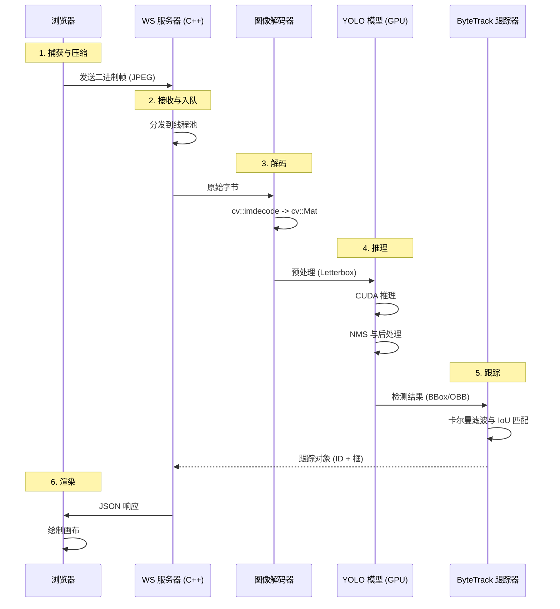

# TrackFlow (交通分析系统)

TrackFlow 是一个高性能的分布式 C++ 视频分析系统，专为实时交通监控而设计。它将基于 YOLO 的目标检测、ByteTrack 多目标跟踪和地理空间坐标转换集成到一个统一的管道中。

## 🏗️ 系统架构

系统采用客户端-服务器架构，使用 WebSocket 进行低延迟通信。

```mermaid
graph TD
    Client[浏览器前端] <-->|WebSocket (JSON + Binary)| Network[网络层]
    Network <-->|转发| Server[C++ 边缘服务器]
    
    subgraph "边缘服务器 (C++)"
        WS[WebSocket 服务器] --> Pipeline[处理管道]
        Pipeline --> Decoder[图像解码器]
        Decoder --> YOLO[YOLO 推理 (GPU)]
        YOLO --> Tracker[ByteTrack 跟踪器]
        Tracker --> Geo[地理坐标转换]
    end
```

### 关键组件

- **前端**: 一个轻量级的 HTML5/JS 客户端，用于捕获视频帧，压缩并通过 WebSocket 发送到服务器。它实时渲染返回的边界框和轨迹。
- **WebSocket 服务器**: 基于 `uWebSockets` 构建，处理高并发连接和二进制数据流。
- **推理引擎**: 使用 **ONNX Runtime** 和 CUDA 执行提供程序进行硬件加速的 YOLO 推理。
- **跟踪模块**: 实现 **ByteTrack** 以进行稳健的多目标跟踪，关联跨帧检测。
- **地理转换**: 使用 **PROJ** 和透视变换将像素坐标转换为真实世界的 GPS 坐标 (经度/纬度)。

---

## 🔄 详细数据工作流

下图展示了单个视频帧的完整生命周期：



1.  **捕获**: 浏览器捕获帧，调整大小/压缩（例如，压缩到 <100KB JPEG）以优化带宽。
2.  **传输**:二进制图像数据通过 WebSocket 发送到 VPS 转发服务器，然后由 VPS 中继到 GPU 服务器。
3.  **解码**: C++ 服务器接收二进制数据块，使用 `ImageDecoder` 将其解码为 OpenCV `cv::Mat`。
4.  **推理**: `YoloDetector` 预处理图像（Letterbox），在 GPU 上通过 ONNX 模型运行，并执行非极大值抑制 (NMS)。
5.  **跟踪**: `ByteTracker` 接收检测框，使用卡尔曼滤波器预测对象位置，并将新检测与现有轨迹关联。
6.  **响应**: 服务器将结果（跟踪 ID、边界框、类别）打包成 JSON 响应并发送回浏览器。

---

## 📂 目录结构

| 路径 | 描述 |
| :--- | :--- |
| `src/` | 核心逻辑、处理器和网络的源代码。 |
| `include/` | 按模块组织的头文件 (`core`, `processors`, `network`)。 |
| `config/` | 配置文件 (例如 `config.yaml`)。 |
| `models/` | ONNX 模型文件。 |
| `scripts/` | 依赖安装和构建的辅助脚本。 |
| `build/` | 编译输出目录。 |
| `test_v4.html` | 用于测试的主要前端客户端。 |

---

## 🚀 安装与设置

### 1. 先决条件
- **操作系统**: Linux (推荐 Ubuntu 20.04+) / WSL2
- **编译器**: GCC 10+ 或 Clang (需要 C++20 支持)
- **CMake**: 版本 3.20+
- **CUDA**: Toolkit 11.x + cuDNN 8.x (用于 GPU 支持)

### 2. 安装依赖项
使用提供的脚本安装 OpenCV, ONNX Runtime 和其他库:

```bash
sudo ./scripts/install_deps.sh
./scripts/install_onnxruntime.sh
```

### 3. 构建项目

```bash
mkdir build && cd build
cmake -DCMAKE_BUILD_TYPE=Release ..
make -j$(nproc)
```

---

## ⚙️ 配置 (`config.yaml`)

系统行为由 `config/config.yaml` 控制。

```yaml
server:
  port: 9001              # WebSocket 监听端口
  threads: 8              # 线程池大小

pipeline:
  - type: decoder
  
  - type: yolo
    model_path: "models/yolo26.onnx"
    confidence: 0.5
    nms_threshold: 0.45
    use_cuda: true        # 启用 GPU 加速
    
  - type: tracker
    track_thresh: 0.5
    match_thresh: 0.8
    
  - type: geo_transform   # 可选
    # ... 地理参数
```

---

## ▶️ 运行服务器

### 标准启动
```bash
./build/yolo_edge_server -c config/config.yaml
```

### 生产模式 (静默)
**重要**: 为了获得最大性能，请在静默模式下运行以避免 I/O 阻塞。

```bash
nohup ./build/yolo_edge_server -c config/config.yaml > /dev/null 2>&1 &
```

### 防火墙规则
确保允许以下端口:
- **8088**: HTTP Web 服务器 (前端)
- **9002**: WebSocket FRP 映射 (外部访问)

```bash
sudo ufw allow 8088
sudo ufw allow 9002
```

---

## 🔌 API 参考

### 推理请求
**二进制消息**: 原始图像字节 (JPEG/PNG)。
**头部 (JSON)**: 在第一帧之前发送或用于更新配置。
```json
{
  "type": "infer_header",
  "request_id": "req_123",
  "config": { ... }
}
```

### 推理结果 (JSON)
```json
{
  "type": "result",
  "frame_id": 101,
  "detections": [
    {
      "track_id": 1,
      "class_name": "car",
      "confidence": 0.88,
      "bbox": [100, 100, 50, 30] // x, y, w, h
    }
  ],
  "timing": {
    "infer_ms": 28.5,
    "total_ms": 35.2
  }
}
```
