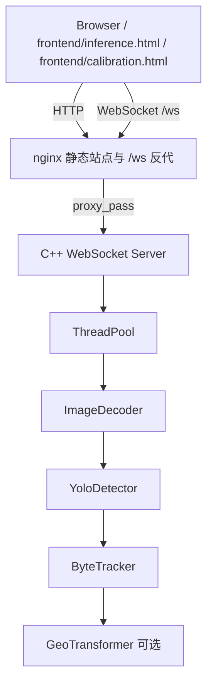

# TrackFlow

TrackFlow 是一个面向交通场景的实时视频分析系统。它把浏览器端采帧、C++ WebSocket 服务、YOLO 目标检测、ByteTrack 多目标跟踪，以及可选的地理坐标转换串成一条完整链路，适合做路口车辆检测、轨迹分析、速度估算和前端可视化验证。

当前仓库偏向“工程化原型 + 实战调优记录”：

- 后端使用 C++20，重点追求低延迟和较高吞吐。
- 推理基于 ONNX Runtime，优先走 CUDA，失败时自动回退 CPU。
- 跟踪基于 ByteTrack，并额外做了按 `frame_id` 严格顺序执行的保护。
- 前端已整理到 `frontend/` 目录，提供 `frontend/inference.html` 与 `frontend/calibration.html` 两个静态页面。
- 仓库还保留了交接、优化、排障文档，适合继续开发和运维。

## 核心能力

### 1. 实时 WebSocket 推理服务

- 基于 `uWebSockets`，支持文本消息和二进制消息
- 支持浏览器先发 `infer_header`，再发 JPEG 二进制帧
- 服务端异步入线程池执行，处理完成后回发 JSON 结果
- 增加了协议校验、队列限流、显式错误返回与更安全的 session 生命周期管理

### 2. YOLO 检测

- 基于 ONNX Runtime
- 支持 CUDA Provider
- 支持 OBB 模型输出
- 模型加载后会读取输入 shape，自动同步输入尺寸
- 已接入共享式 `BatchInferenceEngine`，支持动态 batch 推理
- ORT 线程数、batch 大小、batch 等待时间与队列上限已接入配置

### 3. ByteTrack 跟踪

- 高分框优先匹配，低分框补配
- 跟踪器维护 `track_id`
- 对同一 `session` 的 tracker 阶段强制按 `frame_id` 递增执行
- 支持 `reset` 清空 session，避免旧轨迹污染新流
- 当同一 `session_id` 的有效配置发生变化时，会自动重建 session pipeline

### 4. 可选几何后处理

- `undistort` 处理器可以只对检测中心点做畸变校正
- `geo_transform` 处理器可以把像素坐标映射到地面坐标与经纬度
- 地理转换依赖单应矩阵、原点经纬度和 PROJ

### 5. 前端分析与标定

- `frontend/inference.html`：视频推理、轨迹、车道统计、速度/经纬度展示、CSV 导出
- `frontend/calibration.html`：标定与验证工具，支持 GCP 采集、H 计算、验证结果导出

## 系统架构


```mermaid
graph TD
    Browser[Browser / frontend/inference.html / frontend/calibration.html]
    Nginx[nginx 静态站点与 /ws 反代]
    WS[C++ WebSocket Server]
    Pool[ThreadPool]
    Decoder[ImageDecoder]
    Yolo[YoloDetector]
    Tracker[ByteTracker]
    Geo[GeoTransformer 可选]

    Browser -->|HTTP| Nginx
    Browser -->|WebSocket /ws| Nginx
    Nginx -->|proxy_pass| WS
    WS --> Pool
    Pool --> Decoder
    Decoder --> Yolo
    Yolo --> Tracker
    Tracker --> Geo
```

同一个 `session` 内：

- `decoder` 和 `yolo` 可以在工作线程中尽快执行
- `tracker` 会等待自己的 `frame_id` 轮到后再执行
- 后端按“服务端默认值 + 前端允许覆盖字段”的方式构建有效配置
- 前端表达的是功能意图（如 `tracker / undistort / geo_transform`），后端负责生成最终 pipeline 顺序

## 浏览器到后端的数据流

推荐方式是二进制双消息协议：

1. 浏览器发送一个 JSON 文本头：

```json
{
  "type": "infer_header",
  "request_id": "f_123",
  "frame_id": 123,
  "session_id": "camera_a",
  "features": {
    "tracker": true,
    "undistort": false,
    "geo_transform": true
  },
  "config": {
    "yolo": {
      "confidence": 0.5,
      "nms_threshold": 0.45
    },
    "geo_transform": {
      "homography": [1, 0, 0, 0, 1, 0, 0, 0, 1],
      "origin_lon": 121.4737,
      "origin_lat": 31.2304
    }
  }
}
```

2. 然后立刻发送 JPEG 二进制帧。

服务端现在会对以下情况返回显式错误，而不再静默丢弃：

- 缺失 `request_id`
- `frame_id <= 0`
- `config` / `features` 类型不合法
- 没有 `infer_header` 就收到 binary
- 连续发送两个未配对的 `infer_header`
- 队列已满 / session 当前 outstanding 请求过多

## 支持的消息类型

### `infer_header` + 二进制帧

最推荐的方式。文本头里放控制字段，图片本体走二进制消息，避免 base64 开销。
旧的单条 JSON `infer` + base64 图片方式已移除。

### `ping`

连通性检查。服务端返回：

```json
{
  "type": "pong",
  "request_id": "same-as-request"
}
```

### `reset`

清空指定 `session` 的状态，主要用来重置 tracker：

```json
{
  "type": "reset",
  "request_id": "reset_1",
  "session_id": "camera_a"
}
```

服务端返回：

```json
{
  "type": "reset_ack",
  "request_id": "reset_1",
  "session_id": "camera_a"
}
```

## 目录结构

| 路径 | 说明 |
| --- | --- |
| `src/` | 后端实现，含网络层、处理器和入口 |
| `include/` | 头文件，按 `core / network / processors / utils` 组织 |
| `config/` | 运行配置 |
| `models/` | ONNX 模型目录 |
| `scripts/` | 安装、构建、诊断和测试脚本 |
| `third_party/` | 第三方依赖源码或二进制，如 ONNX Runtime、uWebSockets |
| `frontend/` | 前端静态页面与共享 JS/CSS |
| `HANDOVER.md` | 交接与部署经验记录 |
| `optimization.md` | 优化项及完成状态 |
| `debug.md` | 问题排查记录 |
| `cpp_architecture_design.md` | 设计文档 |

## 关键模块说明

| 文件 | 作用 |
| --- | --- |
| `src/main.cpp` | 命令行参数解析、配置读取、线程池与 WebSocket 服务启动 |
| `src/network/ws_server.cpp` | WebSocket 协议处理、session 路由、限流、配置合并、响应构建 |
| `src/processors/image_decoder.cpp` | 图像解码，接收 JPEG/PNG 等二进制图像输入 |
| `src/processors/yolo_detector.cpp` | YOLO 预处理、推理、后处理、批推理引擎接入 |
| `src/processors/batch_inference_engine.cpp` | 多请求合批推理 |
| `src/processors/byte_tracker.cpp` | ByteTrack 跟踪实现 |
| `src/processors/undistort_processor.cpp` | 检测中心点畸变校正 |
| `src/processors/geo_transformer.cpp` | 地面坐标和经纬度转换 |
| `include/core/session.hpp` | 每个 session 的 pipeline、过期清理、tracker 顺序控制、配置变更重建 |
| `include/core/processor_factory.hpp` | 处理器注册和 pipeline 构建 |
| `frontend/inference.html` | 模块化前端推理页 |
| `frontend/calibration.html` | 模块化标定页 |

## 构建与启动

### 构建

```bash
mkdir -p build
cd build
cmake -DCMAKE_BUILD_TYPE=Release ..
make -j$(nproc)
```

生成的可执行文件为：

```text
build/yolo_edge_server
```

### 启动后端

```bash
./build/yolo_edge_server -c config/config.yaml
```

### 后台运行

```bash
nohup ./build/yolo_edge_server -c config/config.yaml > trackflow.log 2>&1 &
```

## 启动前端调试页

`frontend/inference.html` 和 `frontend/calibration.html` 默认通过 `/ws` 连接 WebSocket，也就是它们预期有一个反向代理把：

```text
http://<host>:8080/ws
```

转发到：

```text
http://127.0.0.1:9001
```

因此，单纯执行 `python3 -m http.server` 只能提供静态文件，不能满足默认联调方式。推荐使用 nginx。

### 本机 nginx 示例

```nginx
server {
    listen 8080;
    root /projects/TrackFlow;

    location /ws {
        proxy_pass http://127.0.0.1:9001;
        proxy_http_version 1.1;
        proxy_set_header Upgrade $http_upgrade;
        proxy_set_header Connection "upgrade";
        proxy_read_timeout 86400;
    }
}
```

配置好后可以直接访问：

- `http://localhost:8080/frontend/inference.html`
- `http://localhost:8080/frontend/calibration.html`

根目录下的 `test_v5.html` 与 `calibration.html` 现在只是兼容跳转入口。

## 配置说明

当前 `config/config.yaml` 分成三层：

1. **后端部署级默认值**
   - `server.port`
   - `server.threads`
   - `yolo.model_path`
   - `yolo.use_cuda`
   - `yolo.ort_threads`
   - `yolo.batch_size`
   - `yolo.batch_wait_ms`
   - `yolo.batch_max_pending`
   - `tracker.*`

2. **功能开关**
   - `features.tracker`
   - `features.undistort`
   - `features.geo_transform`

3. **限制项**
   - `limits.session_timeout_sec`
   - `limits.max_pending_tasks`
   - `limits.max_pending_batches`
   - `limits.max_requests_per_session`
   - `limits.confidence_min/max`
   - `limits.nms_min/max`
   - `limits.tracker_thresh_min/max`
   - `limits.match_thresh_min/max`

前端只允许覆盖会话级参数的子集，例如：

- `yolo.confidence`
- `yolo.nms_threshold`
- `tracker.track_thresh`
- `tracker.high_thresh`
- `tracker.match_thresh`
- `tracker.max_time_lost`
- `tracker.min_hits`
- `undistort.camera_matrix`
- `undistort.dist_coeffs`
- `geo_transform.homography`
- `geo_transform.origin_lon`
- `geo_transform.origin_lat`
- `geo_transform.camera_matrix`
- `geo_transform.dist_coeffs`

pipeline 现在更推荐通过 feature intent 让后端生成。例如：

```json
{
  "features": {
    "tracker": true,
    "undistort": true,
    "geo_transform": true
  }
}
```

后端会生成规范化顺序，例如：

```json
["decoder", "yolo", "undistort", "tracker", "geo_transform"]
```

## 当前已知后续工作

- `Config` 仍然是轻量 YAML 解析器，适合当前配置，但如果层级再变复杂，建议换成熟 YAML 库。
- 前端已经模块化，但还没有引入打包工具；这是有意保持部署简单。
- 根目录旧入口已精简，后续可以完全切换文档与部署路径到 `frontend/`。

## 相关文档

- `optimization.md`：优化项与状态
- `debug.md`：历史问题与当前修复记录
- `HANDOVER.md`：部署与运维步骤
