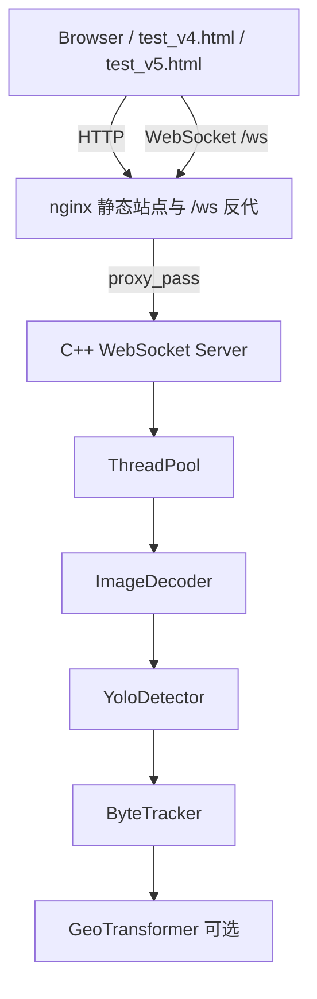

# TrackFlow

TrackFlow 是一个面向交通场景的实时视频分析系统。它把浏览器端采帧、C++ WebSocket 服务、YOLO 目标检测、ByteTrack 多目标跟踪，以及可选的地理坐标转换串成一条完整链路，适合做路口车辆检测、轨迹分析、速度估算和前端可视化验证。

这个仓库当前更偏向“工程化原型 + 实战调优记录”：

- 后端使用 C++20，重点追求低延迟和较高吞吐。
- 推理基于 ONNX Runtime，优先走 CUDA，失败时自动回退 CPU。
- 跟踪基于 ByteTrack，并额外做了按 `frame_id` 严格顺序执行的保护。
- 前端内置 `test_v4.html` 和 `test_v5.html` 两套调试页面，便于直接联调。
- 仓库还保留了交接、优化、排障文档，适合继续开发和运维。

## 适用场景

- 浏览器上传图片帧或视频帧到后端进行实时推理
- 对车辆等目标进行稳定 ID 跟踪
- 返回 OBB / BBox、类别、置信度、轨迹 ID、耗时信息
- 在前端进一步做车道统计、速度估算、CSV 导出
- 在需要时，把像素坐标转换为地面坐标或经纬度

## 核心能力

### 1. 实时 WebSocket 推理服务

- 基于 `uWebSockets`，支持文本消息和二进制消息
- 支持浏览器先发 `infer_header`，再发 JPEG 二进制帧
- 服务端异步入线程池执行，处理完成后回发 JSON 结果

### 2. YOLO 检测

- 基于 ONNX Runtime
- 支持 CUDA Provider
- 支持 OBB 模型输出
- 模型加载后会读取输入 shape，自动同步输入尺寸
- 已接入共享式 `BatchInferenceEngine`，支持动态 batch 推理

### 3. ByteTrack 跟踪

- 高分框优先匹配，低分框补配
- 跟踪器维护 `track_id`
- 对同一 `session` 的 tracker 阶段强制按 `frame_id` 递增执行
- 支持 `reset` 清空 session，避免旧轨迹污染新流

### 4. 可选几何后处理

- `undistort` 处理器可以只对检测中心点做畸变校正
- `geo_transform` 处理器可以把像素坐标映射到地面坐标与经纬度
- 地理转换依赖单应矩阵、原点经纬度和 PROJ

### 5. 前端增强分析

- `test_v4.html`：基础视频推理、可视化、统计信息
- `test_v5.html`：在 v4 基础上增加坐标转换、车道配置、车辆分析面板和 CSV 导出

## 系统架构

默认链路如下：


```mermaid
graph TD
    Browser[Browser / test_v4.html / test_v5.html]
    Nginx[nginx 静态站点与 /ws 反代]
    WS[C++ WebSocket Server]
    Pool[ThreadPool]
    Decoder[ImageDecoder]
    Yolo[YoloDetector]
    Tracker[ByteTracker]
    Geo[GeoTransformer 可选]

    Browser -->|HTTP| Nginx
    Browser -->|WebSocket /ws| Nginx
    Nginx -->|proxy_pass| WS
    WS --> Pool
    Pool --> Decoder
    Decoder --> Yolo
    Yolo --> Tracker
    Tracker --> Geo
```

默认推理请求会创建或复用一个 `session`。同一个 `session` 内：

- `decoder` 和 `yolo` 可以在工作线程中尽快执行
- `tracker` 会等待自己的 `frame_id` 轮到后再执行
- 这样既保留了解码和检测阶段的并行能力，也保证了跟踪顺序不乱

## 数据流

### 浏览器到后端

推荐方式是二进制双消息协议：

1. 浏览器发送一个 JSON 文本头：

```json
{
  "type": "infer_header",
  "request_id": "f_123",
  "frame_id": 123,
  "session_id": "camera_a",
  "config": {
    "yolo": {
      "model_path": "models/yolo26.onnx",
      "confidence": 0.5,
      "nms_threshold": 0.45,
      "use_cuda": true
    },
    "tracker": {
      "track_thresh": 0.5,
      "high_thresh": 0.6,
      "match_thresh": 0.8
    }
  }
}
```

2. 然后立刻发送 JPEG 二进制帧

服务端收到后会：

1. 解码图像
2. 做 YOLO 推理和后处理
3. 做 ByteTrack 跟踪
4. 可选执行几何转换
5. 返回 JSON

### 后端返回结果

```json
{
  "type": "result",
  "request_id": "f_123",
  "session_id": "camera_a",
  "frame_id": 123,
  "detections": [
    {
      "track_id": 7,
      "class_id": 0,
      "class_name": "car",
      "confidence": 0.92,
      "angle": -3.4,
      "obb": [100, 100, 180, 95, 185, 130, 105, 135],
      "bbox": [100, 95, 85, 40],
      "ground_x": 12.4,
      "ground_y": 3.8,
      "lon": 121.4737,
      "lat": 31.2304
    }
  ],
  "timing": {
    "decode_ms": 1.4,
    "infer_ms": 18.9,
    "track_ms": 0.7,
    "geo_ms": 0.2,
    "total_ms": 21.5
  }
}
```

## 支持的消息类型

### `infer_header` + 二进制帧

最推荐的方式。文本头里放控制字段，图片本体走二进制消息，避免 base64 开销。

### `infer`

也支持单条 JSON 请求：

```json
{
  "type": "infer",
  "request_id": "req_1",
  "frame_id": 1,
  "session_id": "camera_a",
  "image": "data:image/jpeg;base64,...",
  "config": {
    "yolo": {
      "confidence": 0.5
    }
  }
}
```

### `ping`

连通性检查。服务端返回：

```json
{
  "type": "pong",
  "request_id": "same-as-request"
}
```

### `reset`

清空指定 `session` 的状态，主要用来重置 tracker：

```json
{
  "type": "reset",
  "request_id": "reset_1",
  "session_id": "camera_a"
}
```

服务端返回：

```json
{
  "type": "reset_ack",
  "request_id": "reset_1",
  "session_id": "camera_a"
}
```

## 目录结构

| 路径 | 说明 |
| --- | --- |
| `src/` | 后端实现，含网络层、处理器和入口 |
| `include/` | 头文件，按 `core / network / processors / utils` 组织 |
| `config/` | 运行配置 |
| `models/` | ONNX 模型目录 |
| `scripts/` | 安装、构建、诊断和测试脚本 |
| `third_party/` | 第三方依赖源码或二进制，如 ONNX Runtime、uWebSockets |
| `test_v4.html` | 基础前端测试页 |
| `test_v5.html` | 增强版前端测试页 |
| `HANDOVER.md` | 交接与部署经验记录 |
| `optimization.md` | 优化项及完成状态 |
| `debug.md` | 问题排查记录 |
| `cpp_architecture_design.md` | 设计文档 |

## 关键模块说明

| 文件 | 作用 |
| --- | --- |
| `src/main.cpp` | 命令行参数解析、配置读取、线程池与 WebSocket 服务启动 |
| `src/network/ws_server.cpp` | WebSocket 协议处理、session 路由、线程池派发、响应构建 |
| `src/processors/image_decoder.cpp` | 图像解码，支持二进制和 base64 输入 |
| `src/processors/yolo_detector.cpp` | YOLO 预处理、推理、后处理、批推理引擎接入 |
| `src/processors/batch_inference_engine.cpp` | 多请求合批推理 |
| `src/processors/byte_tracker.cpp` | ByteTrack 跟踪实现 |
| `src/processors/undistort_processor.cpp` | 检测中心点畸变校正 |
| `src/processors/geo_transformer.cpp` | 地面坐标和经纬度转换 |
| `include/core/session.hpp` | 每个 session 的 pipeline、过期清理、tracker 顺序控制 |
| `include/core/processor_factory.hpp` | 处理器注册和 pipeline 构建 |

## 环境要求

建议环境：

- Ubuntu 20.04+ 或 WSL2
- GCC 10+ 或 Clang，支持 C++20
- CMake 3.20+
- OpenCV
- nlohmann-json
- PROJ
- OpenSSL / zlib
- ONNX Runtime
- CUDA 12.x（如需 GPU 推理）

## 安装依赖

### 1. 安装系统依赖

```bash
sudo ./scripts/install_deps.sh
```

该脚本会安装：

- `build-essential`
- `cmake`
- `git`
- `wget`
- `curl`
- `pkg-config`
- `libopencv-dev`
- `libspdlog-dev`
- `nlohmann-json3-dev`
- `libproj-dev`
- `libssl-dev`
- `zlib1g-dev`
- `libuv1-dev`

### 2. 安装 ONNX Runtime

```bash
./scripts/install_onnxruntime.sh
```

默认会下载 GPU 版 ONNX Runtime 到：

```text
third_party/onnxruntime
```

### 3. 安装 uWebSockets

```bash
./scripts/install_uwebsockets.sh
```

脚本会在 `third_party/uWebSockets` 下拉取源码并编译 `uSockets.a`。

## 构建项目

### 使用脚本

```bash
./scripts/build.sh Release
```

### 手动构建

```bash
mkdir -p build
cd build
cmake -DCMAKE_BUILD_TYPE=Release ..
make -j$(nproc)
```

生成的可执行文件为：

```text
build/yolo_edge_server
```

## 启动后端

### 查看帮助

```bash
./build/yolo_edge_server --help
```

### 使用配置文件启动

```bash
./build/yolo_edge_server -c config/config.yaml
```

### 指定端口和线程

```bash
./build/yolo_edge_server -p 9001 -t 8 -v
```

### 后台运行

```bash
nohup ./build/yolo_edge_server -c config/config.yaml > trackflow.log 2>&1 &
```

## 启动前端调试页

`test_v4.html` 和 `test_v5.html` 默认通过：

```text
/ws
```

连接 WebSocket，也就是它们预期有一个反向代理把：

```text
http://<host>:8080/ws
```

转发到：

```text
http://127.0.0.1:9001
```

因此，单纯执行 `python3 -m http.server` 只能提供静态文件，不能满足默认联调方式。推荐使用 nginx。

### 本机 nginx 示例

```nginx
server {
    listen 8080;
    root /projects/TrackFlow;

    location /ws {
        proxy_pass http://127.0.0.1:9001;
        proxy_http_version 1.1;
        proxy_set_header Upgrade $http_upgrade;
        proxy_set_header Connection "upgrade";
        proxy_read_timeout 86400;
    }
}
```

配置好后可以直接访问：

- `http://localhost:8080/test_v4.html`
- `http://localhost:8080/test_v5.html`

## 配置说明

### 1. 启动配置文件 `config/config.yaml`

当前 `main.cpp` 在启动阶段实际读取的是：

- `server.port`
- `server.threads`

示例：

```yaml
server:
  port: 9001
  threads: 8
```

当前仓库里的 `config/config.yaml` 还包含 `models`、`tracker`、`logging` 等字段，但这些字段并不会在服务启动时自动注入处理器。

另外，当前 `Config` 中的 YAML 读取实现是一个轻量级解析器，更适合简单启动配置；复杂运行参数建议通过请求里的 JSON `config` 传入。

### 2. 处理器运行参数

YOLO、tracker、geo_transform 等处理器的参数，主要是在 WebSocket 请求里的 `config` 字段中传入，并在创建 session pipeline 时合并生效。

例如：

```json
{
  "config": {
    "yolo": {
      "model_path": "models/yolo26.onnx",
      "confidence": 0.5,
      "nms_threshold": 0.45,
      "is_obb": true,
      "use_cuda": true,
      "input_width": 1280,
      "input_height": 1280
    },
    "tracker": {
      "track_thresh": 0.5,
      "high_thresh": 0.6,
      "match_thresh": 0.8,
      "max_time_lost": 30,
      "min_hits": 3
    }
  }
}
```

### 3. 自定义 pipeline

如果请求体显式包含 `pipeline`，服务端会按该 pipeline 创建处理链。例如：

```json
{
  "type": "infer",
  "request_id": "req_1",
  "session_id": "camera_a",
  "frame_id": 1,
  "image": "data:image/jpeg;base64,...",
  "pipeline": ["decoder", "yolo", "tracker", "geo_transform"],
  "config": {
    "yolo": {
      "model_path": "models/yolo26.onnx"
    },
    "geo_transform": {
      "homography": [1, 0, 0, 0, 1, 0, 0, 0, 1],
      "origin_lon": 121.4737,
      "origin_lat": 31.2304
    }
  }
}
```

当前已注册的处理器类型包括：

- `decoder`
- `yolo`
- `tracker`
- `undistort`
- `geo_transform`

## 模型说明

- 默认前端示例会使用 `models/yolo26.onnx`
- `YoloDetector` 默认类别名包含 `car / truck / bus / motorcycle / bicycle / person / traffic_light / stop_sign`
- 如果模型是动态 batch ONNX，`BatchInferenceEngine` 可以合并多帧请求

如果你需要从 `.pt` 导出 ONNX，可以参考：

```bash
python export_onnx.py --model your_model.pt --imgsz 1280
```

## Session 与并发行为

这部分是实际使用中最重要的工程约束之一：

- 服务端会按 `session_id` 维护独立 pipeline 和 tracker 状态
- 如果请求没有提供 `session_id`，服务端会为每个 WebSocket 连接生成一个默认 session
- `reset` 会删除对应 session
- 为防止并发情况下 tracker 顺序混乱，tracker 阶段要求 `frame_id` 按序推进
- 如果客户端重新开始一段新视频流，建议从 `frame_id = 1` 重新计数，并先发送一次 `reset`

## 性能相关实现

仓库里已经做了几项和吞吐、延迟直接相关的优化：

- 解码阶段对二进制图像使用 `shared_ptr + cv::Mat view`，避免额外拷贝
- YOLO 预处理使用 `thread_local` 缓冲，减少重复分配
- 批推理引擎支持多请求合并
- tracker 只在需要的阶段串行，解码和检测阶段尽量并行
- `undistort` 只处理检测中心点，不处理整帧

更完整的优化记录见 [optimization.md](./optimization.md)。

## 常见问题

### 1. 前端页面能打开，但连不上 WebSocket

优先检查：

- 后端 `yolo_edge_server` 是否在监听 `9001`
- nginx 是否把 `/ws` 正确反代到 `9001`
- 浏览器访问地址和 WebSocket 地址是否同源

### 2. 服务启动了，但模型不工作

优先检查：

- `models/` 下模型文件是否存在
- `third_party/onnxruntime` 是否安装完成
- CUDA Provider 是否可用
- 模型输入尺寸与预期是否一致

### 3. 跟踪 ID 不稳定

优先检查：

- 客户端是否保证 `frame_id` 单调递增
- 新视频开始前是否先发了 `reset`
- 模型输出和阈值配置是否合适

### 4. 地理坐标结果异常

优先检查：

- `homography` 是否为 3x3 共 9 个值
- `origin_lon` / `origin_lat` 是否正确
- 相机内参与畸变参数是否和当前视频一致

更多历史问题见 [debug.md](./debug.md)。

## 相关文档

- [HANDOVER.md](./HANDOVER.md)：部署、转发、联调交接记录
- [optimization.md](./optimization.md)：优化路线与完成情况
- [debug.md](./debug.md)：问题排查日志
- [cpp_architecture_design.md](./cpp_architecture_design.md)：系统设计草稿

## 后续开发建议

如果你准备继续把这个仓库做成稳定服务，建议优先补这几件事：

1. 把 `config/config.yaml` 的模型和 tracker 配置真正接到后端启动流程里
2. 给 README 里的 nginx / 部署示例补一份最小可运行配置
3. 为 `infer`、`reset`、session 生命周期增加自动化测试
4. 把生产环境的地址、口令、转发配置从交接文档中分离到安全位置

## License

当前仓库未声明许可证。如需开源或分发，建议补充明确的 License 文件。
